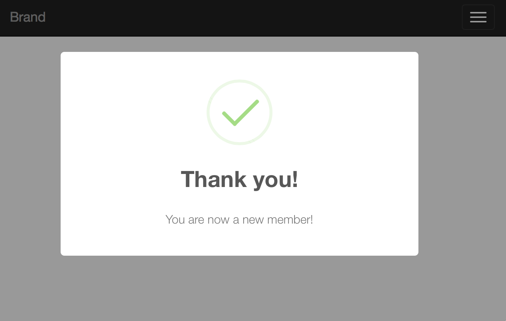
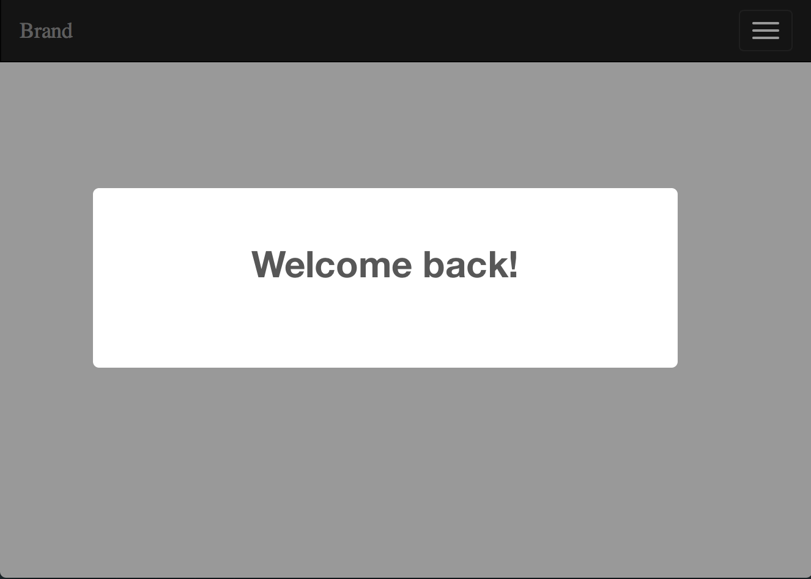
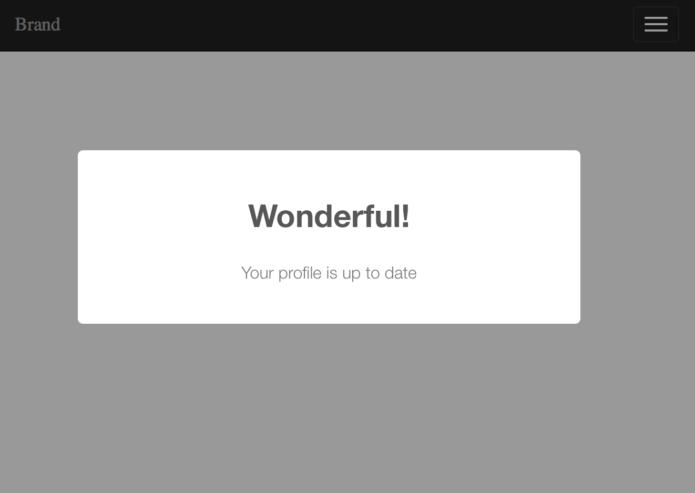
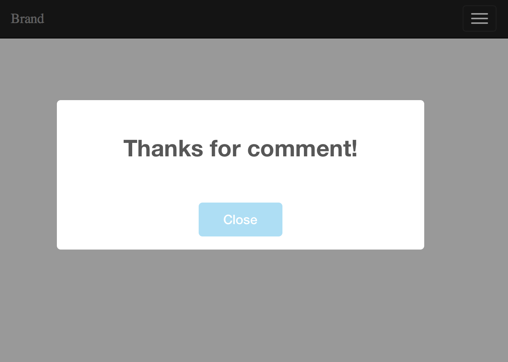
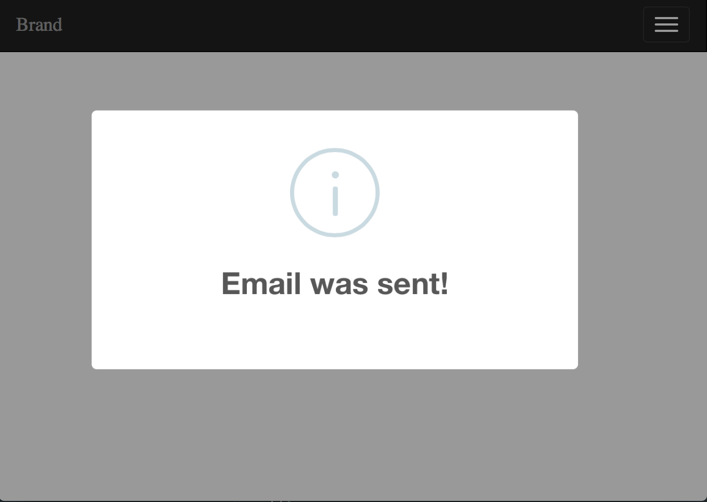
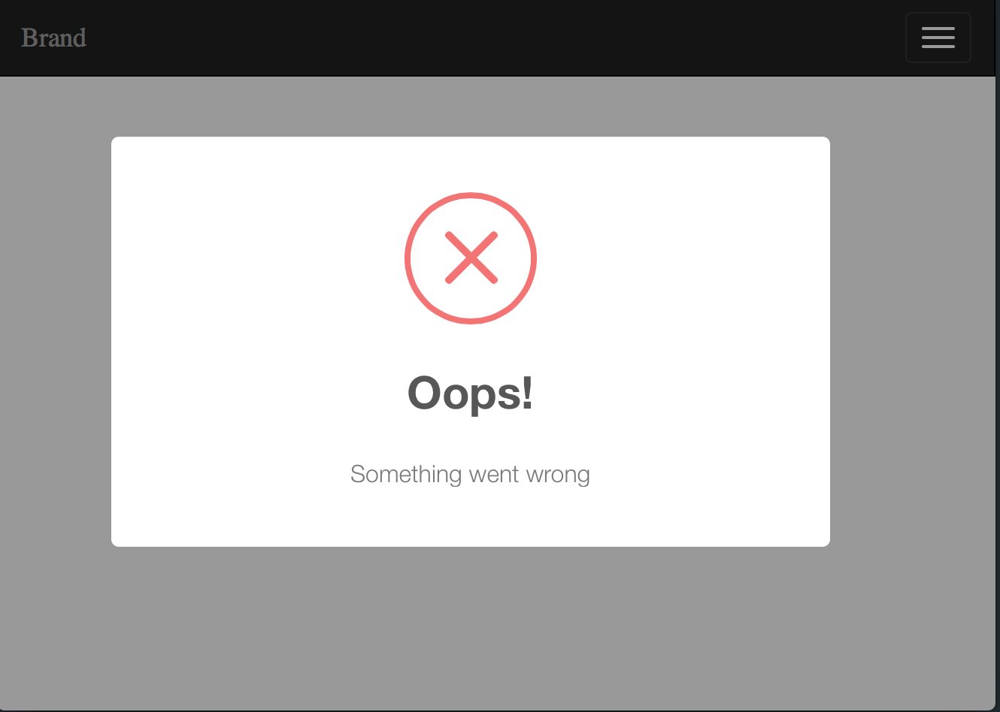
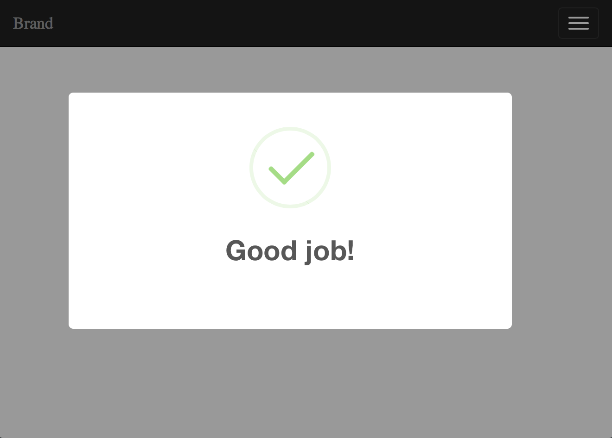
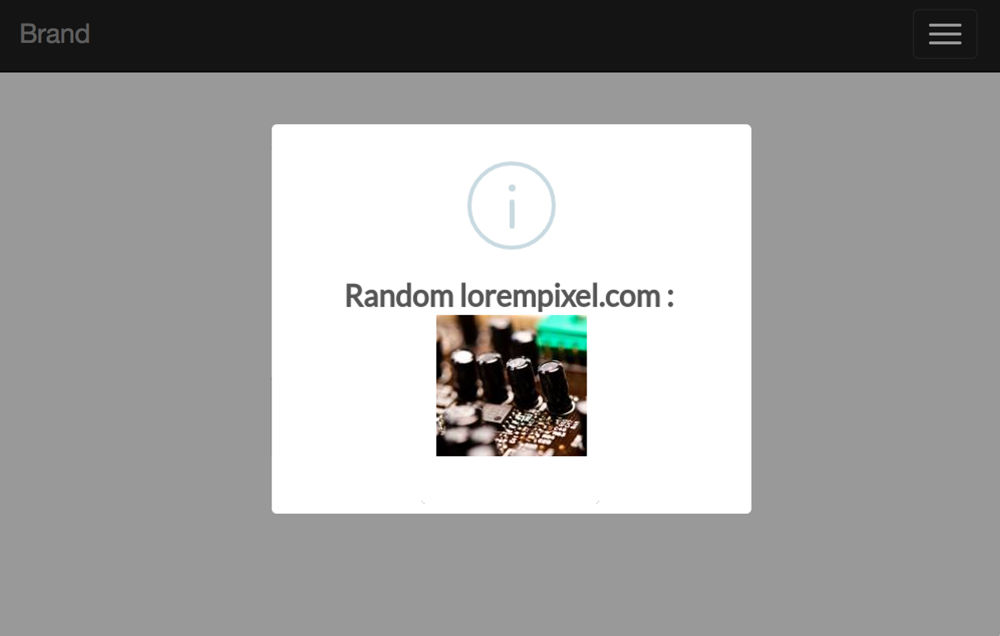
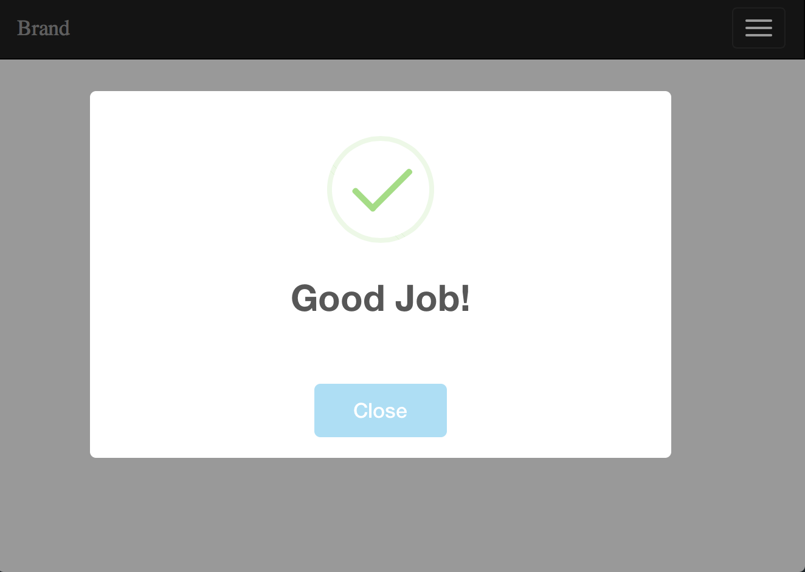

# Easy Sweet Alert Messages for Laravel



[](https://github.com/uxweb/sweet-alert/releases)
[](https://styleci.io/repos/38935942)
[](https://packagist.org/packages/uxweb/sweet-alert)

## Installation

Require the package using Composer.

```bash
composer require uxweb/sweet-alert
```

If using laravel < 5.5 include the service provider and alias within `config/app.php`.

```php
'providers' => [
    UxWeb\SweetAlert\SweetAlertServiceProvider::class,
];

'aliases' => [
    'Alert' => UxWeb\SweetAlert\SweetAlert::class,
];
```

## Installing Frontend Dependency

This package works only by using the [BEAUTIFUL REPLACEMENT FOR JAVASCRIPT'S "ALERT"](https://sweetalert.js.org/).

### Using a CDN

```html
<!DOCTYPE html>
<html lang="en">
  <head>
    <!-- Include this in your blade layout -->
    <script src="https://unpkg.com/sweetalert/dist/sweetalert.min.js"></script>
  </head>
  <body>
    @include('sweet::alert')
  </body>
</html>
```

### Using Laravel Mix

Install using Yarn

```bash
yarn add sweetalert --dev
```

Install using NPM

```bash
npm install sweetalert --save-dev
```

Require sweetalert within your `resources/js/bootstrap.js` file.

```javascript
// ...

require("sweetalert");

// ...
```

Then make sure to include your scripts in your blade layout. Remove the `defer` attribute if your script tag contains it, `defer` will delay the execution of the script which will cause an error as the `sweet::alert` blade template is rendered first by the browser as html.

```html
<!DOCTYPE html>
<html lang="en">
  <head>
    <!-- Scripts -->
    <script src="{{ asset('js/app.js') }}"></script>
  </head>
  <body>
    @include('sweet::alert')
  </body>
</html>
```

Finally compile your assets with Mix

```bash
npm run dev
```

## Usage

### Using the Facade

First import the Alert facade in your controller.

```php
use Alert;
```

Within your controllers, before you perform a redirect...

```php
public function store()
{
    Alert::message('Robots are working!');

    return Redirect::home();
}
```

Here are some examples on how you can use the facade:

```php
Alert::message('Message', 'Optional Title');

Alert::basic('Basic Message', 'Mandatory Title');

Alert::info('Info Message', 'Optional Title');

Alert::success('Success Message', 'Optional Title');

Alert::error('Error Message', 'Optional Title');

Alert::warning('Warning Message', 'Optional Title');
```

### Using the helper function

`alert($message = null, $title = '')`

In addition to the previous listed methods you can also just use the helper
function without specifying any message type. Doing so is similar to:

`alert()->message('Message', 'Optional Title')`

Like with the Facade we can use the helper with the same methods:

```php
alert()->message('Message', 'Optional Title');

alert()->basic('Basic Message', 'Mandatory Title');

alert()->info('Info Message', 'Optional Title');

alert()->success('Success Message', 'Optional Title');

alert()->error('Error Message', 'Optional Title');

alert()->warning('Warning Message', 'Optional Title');

alert()->basic('Basic Message', 'Mandatory Title')->autoclose(3500);

alert()->error('Error Message', 'Optional Title')->persistent('Close');
```

Within your controllers, before you perform a redirect...

```php
/**
 * Destroy the user's session (logout).
 *
 * @return Response
 */
public function destroy()
{
    Auth::logout();

    alert()->success('You have been logged out.', 'Good bye!');

    return home();
}
```

For a general information alert, just do: `alert('Some message');` (same as `alert()->message('Some message');`).

### Using the Middleware

#### Middleware Groups

First register the middleware in web middleware groups by simply adding the middleware class `UxWeb\SweetAlert\ConvertMessagesIntoSweetAlert::class` into the \$middlewareGroups of your app/Http/Kernel.php class:

```php
protected $middlewareGroups = [
    'web' => [
        \App\Http\Middleware\EncryptCookies::class,
        ...
        \UxWeb\SweetAlert\ConvertMessagesIntoSweetAlert::class,
    ],

    'api' => [
        'throttle:60,1',
    ],
];
```

> Make sure you register the middleware within the 'web' group only.

#### Route Middleware

Or if you would like to assign the middleware to specific routes only, you should add the middleware to `$routeMiddleware` in `app/Http/Kernel.php` file:

```php
protected $routeMiddleware = [
    'auth' => \App\Http\Middleware\Authenticate::class,
    ....
    'sweetalert' => \UxWeb\SweetAlert\ConvertMessagesIntoSweetAlert::class,
];
```

Next step: within your controllers, set your return message (using `with()`) and send the proper message and proper type.

```PHP
return redirect('dashboard')->with('success', 'Profile updated!');
```

or

```PHP
return redirect()->back()->with('error', 'Profile updated!');
```

> **NOTE**: When using the middleware it will make an alert to display if it detects any of the following keys flashed into the session: `error`, `success`, `warning`, `info`, `message`, `basic`.

### Final Considerations

By default, all alerts will dismiss after a sensible default number of seconds.

But not to worry, if you need to specify a different time you can:

```php
// -> Remember!, the number is set in milliseconds
alert('Hello World!')->autoclose(3000);
```

Also, if you need the alert to be persistent on the page until the user dismiss it by pressing the alert confirmation button:

```php
// -> The text will appear in the button
alert('Hello World!')->persistent("Close this");
```

You can render html in your message with the html() method like this:

```php
// -> html will be evaluated
alert('<a href="#">Click me</a>')->html()->persistent("No, thanks");
```

## Customize

### Config

If you need to customize the default configuration options for this package just export the configuration file:

```bash
php artisan vendor:publish --provider "UxWeb\SweetAlert\SweetAlertServiceProvider" --tag=config
```

A `sweet-alert.php` configuration file will be published to your `config` directory. By now, the only configuration that can be changed is the timer for all autoclose alerts.

### View

If you need to customize the included alert message view, run:

```bash
php artisan vendor:publish --provider "UxWeb\SweetAlert\SweetAlertServiceProvider" --tag=views
```

The package view is located in the `resources/views/vendor/sweet/` directory.

You can customize this view to fit your needs.

#### Configuration Options

You have access to the following configuration options to build a custom view:

```php
Session::get('sweet_alert.text')
Session::get('sweet_alert.title')
Session::get('sweet_alert.icon')
Session::get('sweet_alert.closeOnClickOutside')
Session::get('sweet_alert.buttons')
Session::get('sweet_alert.timer')
```

Please check the CONFIGURATION section in the [website](https://sweetalert.js.org/docs/#configuration) for all other options available.

### Default View

The `sweet_alert.alert` session key contains a JSON configuration object to pass it directly to Sweet Alert.

```html
@if (Session::has('sweet_alert.alert'))
<script>
  swal({!! Session::get('sweet_alert.alert') !!});
</script>
@endif
```

Note that `{!! !!}` are used to output the json configuration object unescaped, it will not work with `{{ }}` escaped output tags.

### Custom View

This is an example of how you can customize your view to fit your needs:

```html
@if (Session::has('sweet_alert.alert'))
<script>
  swal({
      text: "{!! Session::get('sweet_alert.text') !!}",
      title: "{!! Session::get('sweet_alert.title') !!}",
      timer: {!! Session::get('sweet_alert.timer') !!},
      icon: "{!! Session::get('sweet_alert.type') !!}",
      buttons: "{!! Session::get('sweet_alert.buttons') !!}",

      // more options
  });
</script>
@endif
```

Note that you must use `""` (double quotes) to wrap the values except for the timer option.

## Tests

To run the included test suite:

```bash
vendor/bin/phpunit
```

## Demo

```php
Alert::message('Welcome back!');

return Redirect::home();
```



```php
Alert::message('Your profile is up to date', 'Wonderful!');

return Redirect::home();
```



```php
Alert::message('Thanks for comment!')->persistent('Close');

return Redirect::home();
```



```php
Alert::info('Email was sent!');

return Redirect::home();
```



```php
Alert::error('Something went wrong', 'Oops!');

return Redirect::home();
```



```php
Alert::success('Good job!');

return Redirect::home();
```



```php
Alert::info('Random lorempixel.com : ')->html();

return Redirect::home();
```



```php
Alert::success('Good job!')->persistent("Close");

return Redirect::home();
```


